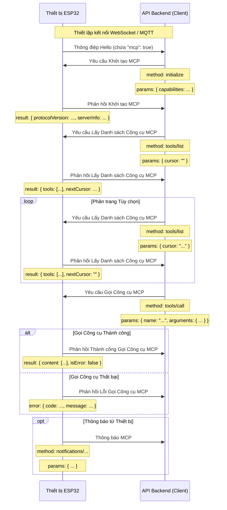

# Quy trình tương tác MCP (Model Context Protocol)

LƯU Ý: Được tạo bởi hỗ trợ AI, khi thực hiện dịch vụ backend, vui lòng tham khảo mã để xác nhận chi tiết!!

Giao thức MCP trong dự án này được sử dụng cho giao tiếp giữa API backend (MCP client) và thiết bị ESP32 (MCP server), để backend có thể phát hiện và gọi các chức năng (công cụ) mà thiết bị cung cấp.

## Định dạng giao thức

Dựa trên mã (`main/protocols/protocol.cc`, `main/mcp_server.cc`), thông điệp MCP được đóng gói trong thân thông điệp của giao thức giao tiếp cơ bản (như WebSocket hoặc MQTT). Cấu trúc bên trong tuân theo chuẩn [JSON-RPC 2.0](https://www.jsonrpc.org/specification).

Ví dụ cấu trúc thông điệp tổng thể:

```json
{
  "session_id": "...", // ID phiên
  "type": "mcp",       // Loại thông điệp, cố định là "mcp"
  "payload": {         // Tải JSON-RPC 2.0
    "jsonrpc": "2.0",
    "method": "...",   // Tên phương thức (như "initialize", "tools/list", "tools/call")
    "params": { ... }, // Tham số phương thức (đối với request)
    "id": ...,         // ID yêu cầu (đối với request và response)
    "result": { ... }, // Kết quả thực thi phương thức (đối với success response)
    "error": { ... }   // Thông tin lỗi (đối với error response)
  }
}
```

Trong đó, phần `payload` là thông điệp JSON-RPC 2.0 chuẩn:

- `jsonrpc`: Chuỗi cố định "2.0".
- `method`: Tên phương thức cần gọi (đối với Request).
- `params`: Tham số của phương thức, một giá trị có cấu trúc, thường là đối tượng (đối với Request).
- `id`: Mã định danh yêu cầu, client cung cấp khi gửi yêu cầu, server trả về nguyên vẹn khi phản hồi. Dùng để khớp yêu cầu và phản hồi.
- `result`: Kết quả khi phương thức thực thi thành công (đối với Success Response).
- `error`: Thông tin lỗi khi phương thức thực thi thất bại (đối với Error Response).

## Quy trình tương tác và thời điểm gửi

Tương tác MCP chủ yếu xoay quanh việc client (API backend) phát hiện và gọi "công cụ" (Tool) trên thiết bị.

1.  **Thiết lập kết nối và thông báo khả năng**

    - **Thời điểm:** Sau khi thiết bị khởi động và kết nối thành công với API backend.
    - **Bên gửi:** Thiết bị.
    - **Thông điệp:** Thiết bị gửi thông điệp "hello" của giao thức cơ bản đến API backend, trong đó chứa danh sách khả năng mà thiết bị hỗ trợ, ví dụ hỗ trợ giao thức MCP (`"mcp": true`).
    - **Ví dụ (không phải tải MCP, mà là thông điệp giao thức cơ bản):**
      ```json
      {
        "type": "hello",
        "version": ...,
        "features": {
          "mcp": true,
          ...
        },
        "transport": "websocket", // hoặc "mqtt"
        "audio_params": { ... },
        "session_id": "..." // Thiết bị có thể thiết lập sau khi nhận hello từ server
      }
      ```

2.  **Khởi tạo phiên MCP**

    - **Thời điểm:** API backend nhận thông điệp "hello" từ thiết bị, xác nhận thiết bị hỗ trợ MCP, thường gửi như yêu cầu đầu tiên của phiên MCP.
    - **Bên gửi:** API backend (client).
    - **Phương thức:** `initialize`
    - **Thông điệp (tải MCP):**

      ```json
      {
        "jsonrpc": "2.0",
        "method": "initialize",
        "params": {
          "capabilities": {
            // Khả năng client, tùy chọn

            // Liên quan đến tầm nhìn camera
            "vision": {
              "url": "...", // Camera: Địa chỉ xử lý hình ảnh (phải là địa chỉ http, không phải websocket)
              "token": "..." // token url
            }

            // ... các khả năng client khác
          }
        },
        "id": 1 // ID yêu cầu
      }
      ```

    - **Thời điểm phản hồi của thiết bị:** Sau khi thiết bị nhận và xử lý yêu cầu `initialize`.
    - **Thông điệp phản hồi của thiết bị (tải MCP):**
      ```json
      {
        "jsonrpc": "2.0",
        "id": 1, // Khớp ID yêu cầu
        "result": {
          "protocolVersion": "2024-11-05",
          "capabilities": {
            "tools": {} // tools ở đây dường như không liệt kê chi tiết, cần tools/list
          },
          "serverInfo": {
            "name": "...", // Tên thiết bị (BOARD_NAME)
            "version": "..." // Phiên bản firmware thiết bị
          }
        }
      }
      ```

3.  **Phát hiện danh sách công cụ của thiết bị**

    - **Thời điểm:** Khi API backend cần lấy danh sách các chức năng (công cụ) cụ thể mà thiết bị hiện hỗ trợ và cách gọi chúng.
    - **Bên gửi:** API backend (client).
    - **Phương thức:** `tools/list`
    - **Thông điệp (tải MCP):**
      ```json
      {
        "jsonrpc": "2.0",
        "method": "tools/list",
        "params": {
          "cursor": "" // Dùng cho phân trang, yêu cầu đầu tiên là chuỗi rỗng
        },
        "id": 2 // ID yêu cầu
      }
      ```
    - **Thời điểm phản hồi của thiết bị:** Sau khi thiết bị nhận yêu cầu `tools/list` và tạo danh sách công cụ.
    - **Thông điệp phản hồi của thiết bị (tải MCP):**
      ```json
      {
        "jsonrpc": "2.0",
        "id": 2, // Khớp ID yêu cầu
        "result": {
          "tools": [ // Danh sách đối tượng công cụ
            {
              "name": "self.get_device_status",
              "description": "...",
              "inputSchema": { ... } // schema tham số
            },
            {
              "name": "self.audio_speaker.set_volume",
              "description": "...",
              "inputSchema": { ... } // schema tham số
            }
            // ... nhiều công cụ hơn
          ],
          "nextCursor": "..." // Nếu danh sách lớn cần phân trang, sẽ chứa giá trị cursor cho yêu cầu tiếp theo
        }
      }
      ```
    - **Xử lý phân trang:** Nếu trường `nextCursor` không rỗng, client cần gửi lại yêu cầu `tools/list` và mang theo giá trị `cursor` này trong `params` để lấy trang tiếp theo.

4.  **Gọi công cụ của thiết bị**

    - **Thời điểm:** Khi API backend cần thực thi một chức năng cụ thể trên thiết bị.
    - **Bên gửi:** API backend (client).
    - **Phương thức:** `tools/call`
    - **Thông điệp (tải MCP):**
      ```json
      {
        "jsonrpc": "2.0",
        "method": "tools/call",
        "params": {
          "name": "self.audio_speaker.set_volume", // Tên công cụ cần gọi
          "arguments": {
            // Tham số công cụ, định dạng đối tượng
            "volume": 50 // Tên tham số và giá trị
          }
        },
        "id": 3 // ID yêu cầu
      }
      ```
    - **Thời điểm phản hồi của thiết bị:** Sau khi thiết bị nhận yêu cầu `tools/call` và thực thi hàm công cụ tương ứng.
    - **Thông điệp phản hồi thành công của thiết bị (tải MCP):**
      ```json
      {
        "jsonrpc": "2.0",
        "id": 3, // Khớp ID yêu cầu
        "result": {
          "content": [
            // Nội dung kết quả thực thi công cụ
            { "type": "text", "text": "true" } // Ví dụ: set_volume trả về bool
          ],
          "isError": false // Chỉ thành công
        }
      }
      ```
    - **Thông điệp phản hồi thất bại của thiết bị (tải MCP):**
      ```json
      {
        "jsonrpc": "2.0",
        "id": 3, // Khớp ID yêu cầu
        "error": {
          "code": -32601, // Mã lỗi JSON-RPC, ví dụ Method not found (-32601)
          "message": "Unknown tool: self.non_existent_tool" // Mô tả lỗi
        }
      }
      ```

5.  **Thiết bị chủ động gửi thông điệp (Notifications)**
    - **Thời điểm:** Khi sự kiện cần thông báo cho API backend xảy ra bên trong thiết bị (ví dụ, thay đổi trạng thái, mặc dù ví dụ mã không có công cụ gửi thông điệp như vậy rõ ràng, nhưng sự tồn tại của `Application::SendMcpMessage` ngụ ý thiết bị có thể chủ động gửi thông điệp MCP).
    - **Bên gửi:** Thiết bị (server).
    - **Phương thức:** Có thể là tên phương thức bắt đầu bằng `notifications/`, hoặc các phương thức tùy chỉnh khác.
    - **Thông điệp (tải MCP):** Tuân theo định dạng JSON-RPC Notification, không có trường `id`.
      ```json
      {
        "jsonrpc": "2.0",
        "method": "notifications/state_changed", // Tên phương thức ví dụ
        "params": {
          "newState": "idle",
          "oldState": "connecting"
        }
        // Không có trường id
      }
      ```
    - **Xử lý của API backend:** Sau khi nhận Notification, API backend xử lý tương ứng, nhưng không phản hồi.

## Sơ đồ tương tác

Dưới đây là sơ đồ trình tự tương tác đơn giản hóa, thể hiện quy trình thông điệp MCP chính:



Tài liệu này tóm tắt quy trình tương tác chính của giao thức MCP trong dự án. Chi tiết tham số cụ thể và chức năng công cụ cần tham khảo `main/mcp_server.cc` trong `McpServer::AddCommonTools` cũng như các triển khai công cụ riêng lẻ.
