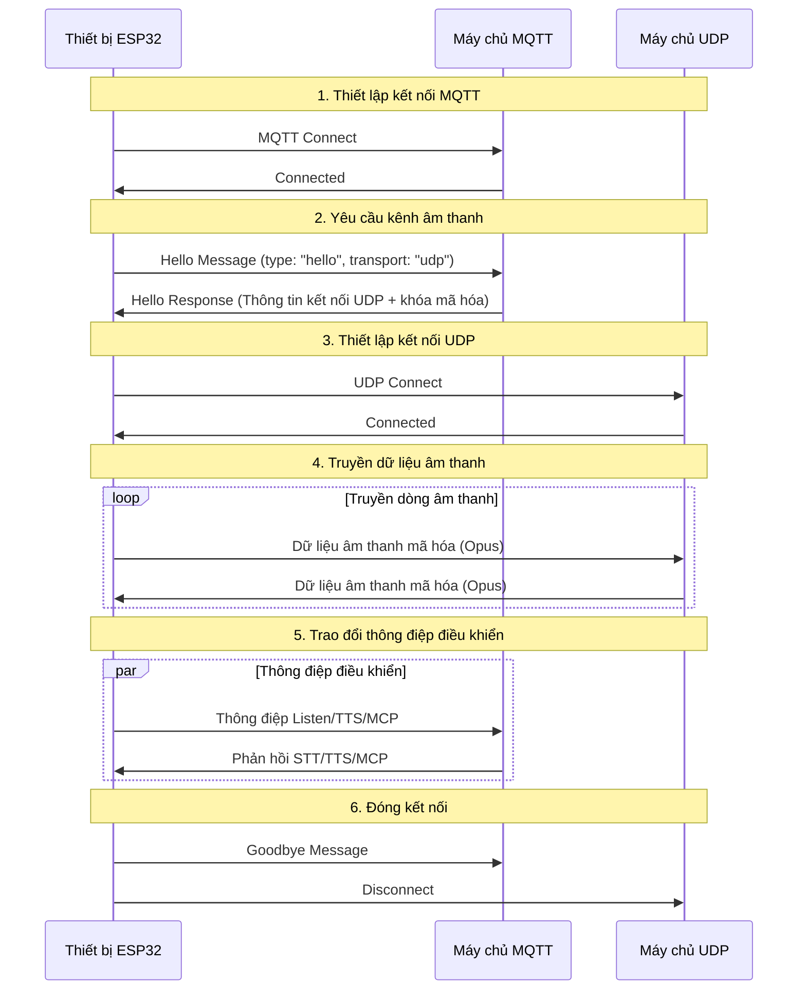
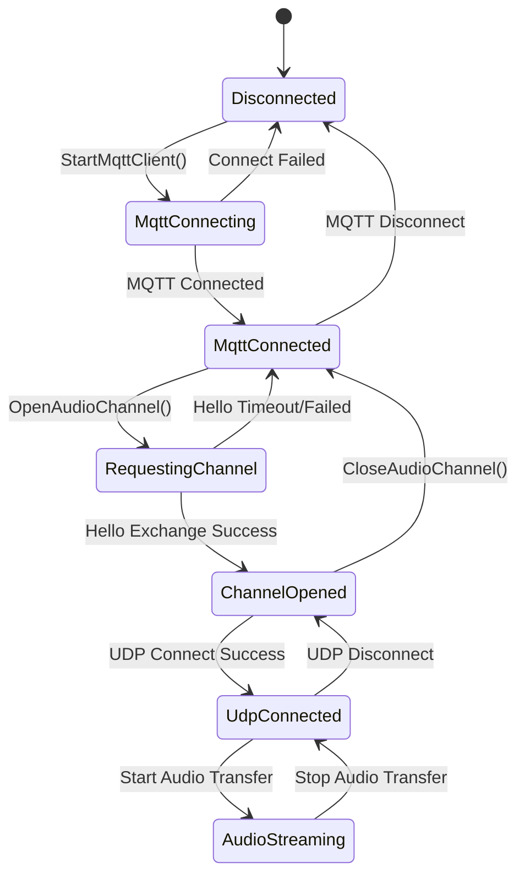

# Tài liệu giao thức giao tiếp hỗn hợp MQTT + UDP

Tài liệu giao thức giao tiếp hỗn hợp MQTT + UDP được tổng hợp dựa trên triển khai mã nguồn, mô tả cách thiết bị và máy chủ trao đổi thông điệp điều khiển qua MQTT, truyền dữ liệu âm thanh qua UDP.

---

## 1. Tổng quan giao thức

Giao thức này sử dụng cách truyền hỗn hợp:
- **MQTT**: Dùng cho thông điệp điều khiển, đồng bộ trạng thái, trao đổi dữ liệu JSON
- **UDP**: Dùng cho truyền dữ liệu âm thanh thời gian thực, hỗ trợ mã hóa

### 1.1 Đặc điểm giao thức

- **Thiết kế kênh kép**: Tách biệt điều khiển và dữ liệu, đảm bảo tính thời gian thực
- **Truyền mã hóa**: Dữ liệu âm thanh UDP sử dụng mã hóa AES-CTR
- **Bảo vệ số thứ tự**: Ngăn chặn phát lại gói tin và rối loạn thứ tự
- **Tự động kết nối lại**: Tự động kết nối lại khi MQTT ngắt kết nối

---

## 2. Tổng quan quy trình tổng thể



---

## 3. Kênh điều khiển MQTT

### 3.1 Thiết lập kết nối

Thiết bị kết nối đến máy chủ qua MQTT, tham số kết nối bao gồm:
- **Endpoint**: Địa chỉ và cổng máy chủ MQTT
- **Client ID**: Định danh duy nhất của thiết bị
- **Username/Password**: Thông tin xác thực
- **Keep Alive**: Khoảng thời gian heartbeat (mặc định 240 giây)

### 3.2 Trao đổi thông điệp Hello

#### 3.2.1 Thiết bị gửi Hello

```json
{
  "type": "hello",
  "version": 3,
  "transport": "udp",
  "features": {
    "mcp": true
  },
  "audio_params": {
    "format": "opus",
    "sample_rate": 16000,
    "channels": 1,
    "frame_duration": 60
  }
}
```

#### 3.2.2 Máy chủ phản hồi Hello

```json
{
  "type": "hello",
  "transport": "udp",
  "session_id": "xxx",
  "audio_params": {
    "format": "opus",
    "sample_rate": 24000,
    "channels": 1,
    "frame_duration": 60
  },
  "udp": {
    "server": "192.168.1.100",
    "port": 8888,
    "key": "0123456789ABCDEF0123456789ABCDEF",
    "nonce": "0123456789ABCDEF0123456789ABCDEF"
  }
}
```

**Giải thích trường:**
- `udp.server`: Địa chỉ máy chủ UDP
- `udp.port`: Cổng máy chủ UDP
- `udp.key`: Khóa mã hóa AES (chuỗi hex)
- `udp.nonce`: Số ngẫu nhiên mã hóa AES (chuỗi hex)

### 3.3 Các loại thông điệp JSON

#### 3.3.1 Thiết bị → Máy chủ

1. **Thông điệp Listen**
   ```json
   {
     "session_id": "xxx",
     "type": "listen",
     "state": "start",
     "mode": "manual"
   }
   ```

2. **Thông điệp Abort**
   ```json
   {
     "session_id": "xxx",
     "type": "abort",
     "reason": "wake_word_detected"
   }
   ```

3. **Thông điệp MCP**
   ```json
   {
     "session_id": "xxx",
     "type": "mcp",
     "payload": {
       "jsonrpc": "2.0",
       "id": 1,
       "result": {...}
     }
   }
   ```

4. **Thông điệp Goodbye**
   ```json
   {
     "session_id": "xxx",
     "type": "goodbye"
   }
   ```

#### 3.3.2 Máy chủ → Thiết bị

Các loại thông điệp được hỗ trợ tương tự giao thức WebSocket, bao gồm:
- **STT**: Kết quả nhận diện giọng nói
- **TTS**: Điều khiển tổng hợp giọng nói
- **LLM**: Điều khiển biểu đạt cảm xúc
- **MCP**: Điều khiển IoT
- **System**: Điều khiển hệ thống
- **Custom**: Thông điệp tùy chỉnh (tùy chọn)

---

## 4. Kênh âm thanh UDP

### 4.1 Thiết lập kết nối

Sau khi nhận phản hồi Hello từ MQTT, thiết bị sử dụng thông tin kết nối UDP để thiết lập kênh âm thanh:
1. Phân tích địa chỉ và cổng máy chủ UDP
2. Phân tích khóa mã hóa và số ngẫu nhiên
3. Khởi tạo ngữ cảnh mã hóa AES-CTR
4. Thiết lập kết nối UDP

### 4.2 Định dạng dữ liệu âm thanh

#### 4.2.1 Cấu trúc gói âm thanh mã hóa

```
|type 1byte|flags 1byte|payload_len 2bytes|ssrc 4bytes|timestamp 4bytes|sequence 4bytes|
|payload payload_len bytes|
```

**Giải thích trường:**
- `type`: Loại gói tin, cố định là 0x01
- `flags`: Cờ đánh dấu, hiện chưa sử dụng
- `payload_len`: Độ dài tải trọng (byte order mạng)
- `ssrc`: Định danh nguồn đồng bộ
- `timestamp`: Dấu thời gian (byte order mạng)
- `sequence`: Số thứ tự (byte order mạng)
- `payload`: Dữ liệu âm thanh Opus mã hóa

#### 4.2.2 Thuật toán mã hóa

Sử dụng chế độ **AES-CTR** để mã hóa:
- **Khóa**: 128 bit, do máy chủ cung cấp
- **Số ngẫu nhiên**: 128 bit, do máy chủ cung cấp
- **Bộ đếm**: Chứa thông tin dấu thời gian và số thứ tự

### 4.3 Quản lý số thứ tự

- **Bên gửi**: `local_sequence_` tăng dần đều
- **Bên nhận**: `remote_sequence_` xác thực tính liên tục
- **Chống phát lại**: Từ chối gói tin có số thứ tự nhỏ hơn giá trị mong đợi
- **Xử lý lỗi**: Cho phép nhảy số thứ tự nhẹ, ghi lại cảnh báo

### 4.4 Xử lý lỗi

1. **Giải mã thất bại**: Ghi lỗi, loại bỏ gói tin
2. **Số thứ tự bất thường**: Ghi cảnh báo, nhưng vẫn xử lý gói tin
3. **Lỗi định dạng gói tin**: Ghi lỗi, loại bỏ gói tin

---

## 5. Quản lý trạng thái

### 5.1 Trạng thái kết nối



### 5.2 Kiểm tra trạng thái

Thiết bị xác định kênh âm thanh có sẵn qua các điều kiện sau:
```cpp
bool IsAudioChannelOpened() const {
    return udp_ != nullptr && !error_occurred_ && !IsTimeout();
}
```

---

## 6. Tham số cấu hình

### 6.1 Cấu hình MQTT

Các mục cấu hình đọc từ cài đặt:
- `endpoint`: Địa chỉ máy chủ MQTT
- `client_id`: Định danh client
- `username`: Tên người dùng
- `password`: Mật khẩu
- `keepalive`: Khoảng thời gian heartbeat (mặc định 240 giây)
- `publish_topic`: Chủ đề xuất bản

### 6.2 Tham số âm thanh

- **Định dạng**: Opus
- **Tỷ lệ lấy mẫu**: 16000 Hz (phía thiết bị) / 24000 Hz (phía máy chủ)
- **Số kênh**: 1 (đơn kênh)
- **Độ dài khung**: 60ms

---

## 7. Xử lý lỗi và kết nối lại

### 7.1 Cơ chế kết nối lại MQTT

- Tự động thử lại khi kết nối thất bại
- Hỗ trợ báo cáo lỗi điều khiển
- Kích hoạt quy trình dọn dẹp khi ngắt kết nối

### 7.2 Quản lý kết nối UDP

- Không tự động thử lại khi kết nối thất bại
- Phụ thuộc vào kênh MQTT để đàm phán lại
- Hỗ trợ truy vấn trạng thái kết nối

### 7.3 Xử lý timeout

Lớp cơ sở `Protocol` cung cấp phát hiện timeout:
- Thời gian timeout mặc định: 120 giây
- Tính toán dựa trên thời gian nhận cuối cùng
- Tự động đánh dấu không khả dụng khi timeout

---

## 8. Cân nhắc bảo mật

### 8.1 Mã hóa truyền

- **MQTT**: Hỗ trợ mã hóa TLS/SSL (cổng 8883)
- **UDP**: Sử dụng mã hóa AES-CTR cho dữ liệu âm thanh

### 8.2 Cơ chế xác thực

- **MQTT**: Xác thực tên người dùng/mật khẩu
- **UDP**: Phân phối khóa qua kênh MQTT

### 8.3 Chống tấn công phát lại

- Số thứ tự tăng dần đều
- Từ chối gói tin hết hạn
- Xác thực dấu thời gian

---

## 9. Tối ưu hóa hiệu suất

### 9.1 Kiểm soát đồng thời

Sử dụng khóa mutex để bảo vệ kết nối UDP:
```cpp
std::lock_guard<std::mutex> lock(channel_mutex_);
```

### 9.2 Quản lý bộ nhớ

- Tạo/tiêu hủy động đối tượng mạng
- Quản lý gói dữ liệu âm thanh bằng con trỏ thông minh
- Giải phóng kịp thời ngữ cảnh mã hóa

### 9.3 Tối ưu hóa mạng

- Tái sử dụng kết nối UDP
- Tối ưu hóa kích thước gói tin
- Kiểm tra tính liên tục số thứ tự

---

## 10. So sánh với giao thức WebSocket

| Đặc tính | MQTT + UDP | WebSocket |
|----------|------------|-----------|
| Kênh điều khiển | MQTT | WebSocket |
| Kênh âm thanh | UDP (mã hóa) | WebSocket (nhị phân) |
| Tính thời gian thực | Cao (UDP) | Trung bình |
| Độ tin cậy | Trung bình | Cao |
| Độ phức tạp | Cao | Thấp |
| Mã hóa | AES-CTR | TLS |
| Tương thích tường lửa | Thấp | Cao |

---

## 11. Gợi ý triển khai

### 11.1 Môi trường mạng

- Đảm bảo cổng UDP có thể truy cập
- Cấu hình quy tắc tường lửa
- Xem xét xuyên NAT

### 11.2 Cấu hình máy chủ

- Cấu hình MQTT Broker
- Triển khai máy chủ UDP
- Hệ thống quản lý khóa

### 11.3 Chỉ số giám sát

- Tỷ lệ kết nối thành công
- Độ trễ truyền âm thanh
- Tỷ lệ mất gói tin
- Tỷ lệ giải mã thất bại

---

## 12. Kết luận

Giao thức hỗn hợp MQTT + UDP thực hiện giao tiếp âm thanh video hiệu quả qua thiết kế sau:

- **Kiến trúc tách biệt**: Tách kênh điều khiển và dữ liệu, mỗi bên đảm nhận vai trò riêng
- **Bảo vệ mã hóa**: AES-CTR đảm bảo truyền dữ liệu âm thanh an toàn
- **Quản lý tuần tự hóa**: Ngăn chặn tấn công phát lại và rối loạn dữ liệu
- **Phục hồi tự động**: Hỗ trợ kết nối lại tự động sau ngắt kết nối
- **Tối ưu hóa hiệu suất**: Truyền UDP đảm bảo tính thời gian thực của dữ liệu âm thanh

Giao thức này phù hợp với các kịch bản tương tác giọng nói yêu cầu tính thời gian thực cao, nhưng cần cân bằng giữa độ phức tạp mạng và hiệu suất truyền.