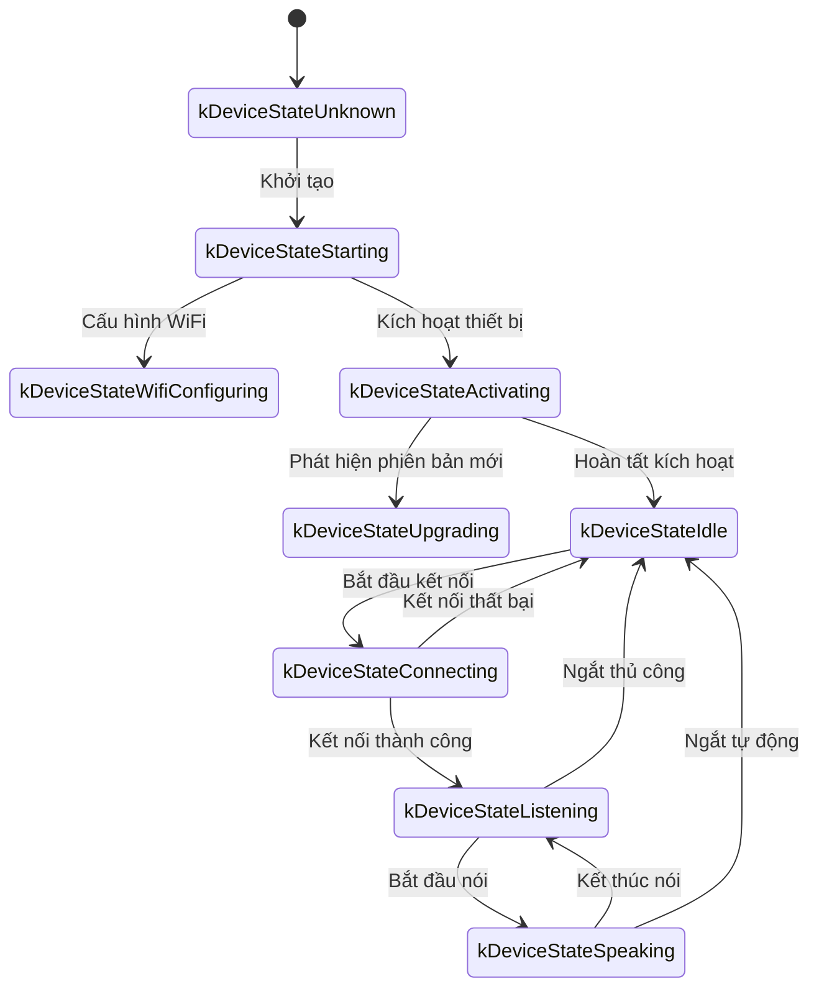
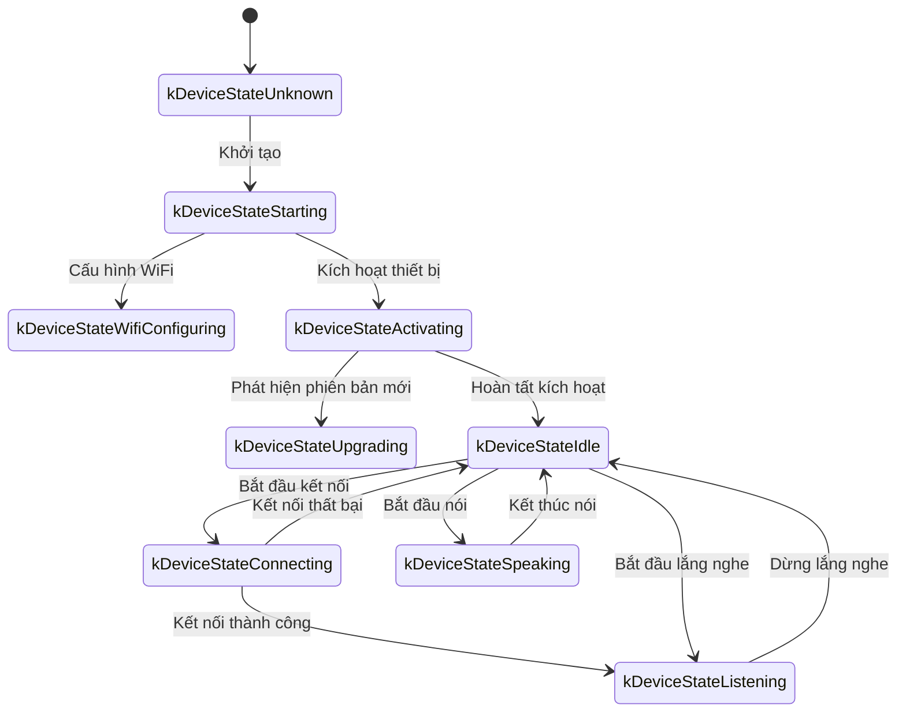

Dưới đây là tài liệu giao thức giao tiếp WebSocket được tổng hợp dựa trên triển khai mã nguồn, mô tả cách thiết bị và máy chủ tương tác qua WebSocket.

Tài liệu này chỉ dựa trên suy luận từ mã nguồn đã cung cấp, khi triển khai thực tế có thể cần kết hợp với triển khai phía máy chủ để xác nhận hoặc bổ sung thêm.

---

## 1. Tổng quan quy trình tổng thể

1. **Khởi tạo phía thiết bị**  
   - Thiết bị bật nguồn, khởi tạo `Application`:  
     - Khởi tạo bộ mã hóa/giải mã âm thanh, màn hình hiển thị, LED v.v.  
     - Kết nối mạng  
     - Tạo và khởi tạo instance giao thức WebSocket triển khai giao diện `Protocol` (`WebsocketProtocol`)  
   - Vào vòng lặp chính chờ sự kiện (đầu vào âm thanh, đầu ra âm thanh, nhiệm vụ lập lịch v.v.).

2. **Thiết lập kết nối WebSocket**  
   - Khi thiết bị cần bắt đầu phiên âm thanh (ví dụ người dùng đánh thức, kích hoạt bằng phím bấm thủ công v.v.), gọi `OpenAudioChannel()`:  
     - Lấy URL WebSocket theo cấu hình  
     - Thiết lập một số request header (`Authorization`, `Protocol-Version`, `Device-Id`, `Client-Id`)  
     - Gọi `Connect()` để thiết lập kết nối WebSocket với máy chủ  

3. **Thiết bị gửi thông điệp "hello"**  
   - Sau khi kết nối thành công, thiết bị gửi một thông điệp JSON, cấu trúc ví dụ như sau:  
     ```json
     {
       "type": "hello",
       "version": 1,
       "features": {
         "mcp": true
       },
       "transport": "websocket",
       "audio_params": {
         "format": "opus",
         "sample_rate": 16000,
         "channels": 1,
         "frame_duration": 60
       }
     }
     ```
   - Trong đó trường `features` là tùy chọn, nội dung được tự động tạo theo cấu hình biên dịch của thiết bị. Ví dụ: `"mcp": true` biểu thị hỗ trợ giao thức MCP.
   - Giá trị `frame_duration` tương ứng với `OPUS_FRAME_DURATION_MS` (ví dụ 60ms).

4. **Máy chủ trả lời "hello"**  
   - Thiết bị chờ máy chủ trả về thông điệp JSON chứa `"type": "hello"`, và kiểm tra `"transport": "websocket"` có khớp không.  
   - Máy chủ có thể gửi xuống trường `session_id`, thiết bị nhận được sẽ tự động ghi nhớ.  
   - Ví dụ:
     ```json
     {
       "type": "hello",
       "transport": "websocket",
       "session_id": "xxx",
       "audio_params": {
         "format": "opus",
         "sample_rate": 24000,
         "channels": 1,
         "frame_duration": 60
       }
     }
     ```
   - Nếu khớp, coi như máy chủ đã sẵn sàng, đánh dấu kênh âm thanh mở thành công.  
   - Nếu trong thời gian timeout (mặc định 10 giây) không nhận được phản hồi đúng, coi như kết nối thất bại và kích hoạt callback lỗi mạng.

5. **Tương tác thông điệp tiếp theo**  
   - Giữa thiết bị và máy chủ có thể gửi hai loại dữ liệu chính:  
     1. **Dữ liệu âm thanh nhị phân** (mã hóa Opus)  
     2. **Thông điệp JSON văn bản** (dùng để truyền trạng thái chat, sự kiện TTS/STT, thông điệp giao thức MCP v.v.)  

   - Trong mã nguồn, callback nhận chủ yếu chia thành:  
     - `OnData(...)`:  
       - Khi `binary` là `true`, coi là khung âm thanh; thiết bị sẽ giải mã nó như dữ liệu Opus.  
       - Khi `binary` là `false`, coi là văn bản JSON, cần phân tích bằng cJSON ở thiết bị và xử lý logic nghiệp vụ tương ứng (như chat, TTS, thông điệp giao thức MCP v.v.).  

   - Khi máy chủ hoặc mạng ngắt kết nối, callback `OnDisconnected()` được kích hoạt:  
     - Thiết bị gọi `on_audio_channel_closed_()`, và cuối cùng trở về trạng thái idle.

6. **Đóng kết nối WebSocket**  
   - Khi thiết bị cần kết thúc phiên âm thanh, gọi `CloseAudioChannel()` để chủ động ngắt kết nối và trở về trạng thái idle.  
   - Hoặc nếu máy chủ chủ động ngắt, cũng sẽ kích hoạt quy trình callback tương tự.

---

## 2. Request header chung

Khi thiết lập kết nối WebSocket, mã nguồn ví dụ thiết lập các request header sau:

- `Authorization`: Dùng để lưu access token, dạng `"Bearer <token>"`  
- `Protocol-Version`: Số phiên bản giao thức, giữ nhất quán với trường `version` trong thân thông điệp hello  
- `Device-Id`: Địa chỉ MAC card mạng vật lý của thiết bị
- `Client-Id`: UUID được tạo bởi phần mềm (xóa NVS hoặc flash lại firmware đầy đủ sẽ reset)

Các header này sẽ được gửi cùng handshake WebSocket đến máy chủ, máy chủ có thể kiểm tra, xác thực theo nhu cầu.

---

## 3. Phiên bản giao thức nhị phân

Thiết bị hỗ trợ nhiều phiên bản giao thức nhị phân, chỉ định qua trường `version` trong cấu hình:

### 3.1 Phiên bản 1 (mặc định)
Gửi trực tiếp dữ liệu âm thanh Opus, không có metadata bổ sung. Giao thức Websocket sẽ phân biệt text và binary.

### 3.2 Phiên bản 2
Sử dụng cấu trúc `BinaryProtocol2`:
```c
struct BinaryProtocol2 {
    uint16_t version;        // Phiên bản giao thức
    uint16_t type;           // Loại thông điệp (0: OPUS, 1: JSON)
    uint32_t reserved;       // Trường dự trữ
    uint32_t timestamp;      // Dấu thời gian (millisecond, dùng cho AEC phía máy chủ)
    uint32_t payload_size;   // Kích thước tải trọng (byte)
    uint8_t payload[];       // Dữ liệu tải trọng
} __attribute__((packed));
```

### 3.3 Phiên bản 3
Sử dụng cấu trúc `BinaryProtocol3`:
```c
struct BinaryProtocol3 {
    uint8_t type;            // Loại thông điệp
    uint8_t reserved;        // Trường dự trữ
    uint16_t payload_size;   // Kích thước tải trọng
    uint8_t payload[];       // Dữ liệu tải trọng
} __attribute__((packed));
```

---

## 4. Cấu trúc thông điệp JSON

Khung văn bản WebSocket truyền theo cách JSON, dưới đây là các trường `"type"` phổ biến và logic nghiệp vụ tương ứng. Nếu thông điệp chứa trường không được liệt kê, có thể là tùy chọn hoặc chi tiết triển khai cụ thể.

### 4.1 Thiết bị → Máy chủ

1. **Hello**  
   - Sau khi kết nối thành công, do thiết bị gửi, thông báo tham số cơ bản cho máy chủ.  
   - Ví dụ:
     ```json
     {
       "type": "hello",
       "version": 1,
       "features": {
         "mcp": true
       },
       "transport": "websocket",
       "audio_params": {
         "format": "opus",
         "sample_rate": 16000,
         "channels": 1,
         "frame_duration": 60
       }
     }
     ```

2. **Listen**  
   - Biểu thị thiết bị bắt đầu hoặc dừng ghi âm lắng nghe.  
   - Trường phổ biến:  
     - `"session_id"`: Định danh phiên  
     - `"type": "listen"`  
     - `"state"`: `"start"`, `"stop"`, `"detect"` (kích hoạt phát hiện đánh thức)  
     - `"mode"`: `"auto"`, `"manual"` hoặc `"realtime"`, biểu thị chế độ nhận diện.  
   - Ví dụ: Bắt đầu lắng nghe  
     ```json
     {
       "session_id": "xxx",
       "type": "listen",
       "state": "start",
       "mode": "manual"
     }
     ```

3. **Abort**  
   - Chấm dứt nói hiện tại (phát TTS) hoặc kênh âm thanh.  
   - Ví dụ:
     ```json
     {
       "session_id": "xxx",
       "type": "abort",
       "reason": "wake_word_detected"
     }
     ```
   - Giá trị `reason` có thể là `"wake_word_detected"` hoặc khác.

4. **Wake Word Detected**  
   - Dùng để thiết bị thông báo máy chủ phát hiện từ đánh thức.
   - Trước khi gửi thông điệp này, có thể gửi trước dữ liệu âm thanh Opus của từ đánh thức, dùng cho phát hiện voiceprint phía máy chủ.  
   - Ví dụ:
     ```json
     {
       "session_id": "xxx",
       "type": "listen",
       "state": "detect",
       "text": "xin chào xiao zhi"
     }
     ```

5. **MCP**
   - Giao thức thế hệ mới được khuyến nghị cho điều khiển IoT. Tất cả khám phá khả năng thiết bị, gọi công cụ v.v. đều qua thông điệp type: "mcp", payload bên trong là JSON-RPC 2.0 chuẩn (chi tiết xem [Tài liệu giao thức MCP](./mcp-protocol.md)).
   
   - **Ví dụ thiết bị gửi result đến máy chủ:**
     ```json
     {
       "session_id": "xxx",
       "type": "mcp",
       "payload": {
         "jsonrpc": "2.0",
         "id": 1,
         "result": {
           "content": [
             { "type": "text", "text": "true" }
           ],
           "isError": false
         }
       }
     }
     ```

---

### 4.2 Máy chủ → Thiết bị

1. **Hello**  
   - Thông điệp xác nhận handshake trả về từ máy chủ.  
   - Phải chứa `"type": "hello"` và `"transport": "websocket"`.  
   - Có thể kèm `audio_params`, biểu thị tham số âm thanh mong đợi của máy chủ, hoặc cấu hình đồng bộ với thiết bị.   
   - Máy chủ có thể gửi xuống trường `session_id`, thiết bị nhận được sẽ tự động ghi nhớ.  
   - Sau khi nhận thành công, thiết bị thiết lập cờ sự kiện, biểu thị kênh WebSocket sẵn sàng.

2. **STT**  
   - `{"session_id": "xxx", "type": "stt", "text": "..."}`
   - Biểu thị máy chủ nhận diện được giọng nói người dùng. (Ví dụ kết quả chuyển văn bản giọng nói)  
   - Thiết bị có thể hiển thị văn bản này lên màn hình, sau đó vào quy trình trả lời v.v.

3. **LLM**  
   - `{"session_id": "xxx", "type": "llm", "emotion": "happy", "text": "😀"}`
   - Máy chủ chỉ thị thiết bị điều chỉnh animation biểu cảm / UI biểu đạt.  

4. **TTS**  
   - `{"session_id": "xxx", "type": "tts", "state": "start"}`: Máy chủ chuẩn bị gửi xuống âm thanh TTS, thiết bị vào trạng thái phát "speaking".  
   - `{"session_id": "xxx", "type": "tts", "state": "stop"}`: Biểu thị TTS lần này kết thúc.  
   - `{"session_id": "xxx", "type": "tts", "state": "sentence_start", "text": "..."}`
     - Để thiết bị hiển thị đoạn văn bản hiện tại cần phát hoặc đọc (ví dụ dùng để hiển thị cho người dùng).  

5. **MCP**
   - Máy chủ gửi xuống chỉ thị điều khiển IoT liên quan hoặc trả về kết quả gọi qua thông điệp type: "mcp", cấu trúc payload tương tự trên.
   
   - **Ví dụ máy chủ gửi tools/call đến thiết bị:**
     ```json
     {
       "session_id": "xxx",
       "type": "mcp",
       "payload": {
         "jsonrpc": "2.0",
         "method": "tools/call",
         "params": {
           "name": "self.light.set_rgb",
           "arguments": { "r": 255, "g": 0, "b": 0 }
         },
         "id": 1
       }
     }
     ```

6. **System**
   - Lệnh điều khiển hệ thống, thường dùng cho nâng cấp cập nhật từ xa.
   - Ví dụ:
     ```json
     {
       "session_id": "xxx",
       "type": "system",
       "command": "reboot"
     }
     ```
   - Lệnh hỗ trợ:
     - `"reboot"`: Khởi động lại thiết bị

7. **Custom** (tùy chọn)
   - Thông điệp tùy chỉnh, hỗ trợ khi `CONFIG_RECEIVE_CUSTOM_MESSAGE` được bật.
   - Ví dụ:
     ```json
     {
       "session_id": "xxx",
       "type": "custom",
       "payload": {
         "message": "Nội dung tùy chỉnh"
       }
     }
     ```

8. **Dữ liệu âm thanh: Khung nhị phân**  
   - Khi máy chủ gửi khung nhị phân âm thanh (mã hóa Opus), thiết bị giải mã và phát.  
   - Nếu thiết bị đang ở trạng thái "listening" (ghi âm), khung âm thanh nhận được sẽ bị bỏ qua hoặc xóa để tránh xung đột.

---

## 5. Mã hóa/giải mã âm thanh

1. **Thiết bị gửi dữ liệu ghi âm**  
   - Đầu vào âm thanh sau khi qua loại bỏ echo có thể, giảm nhiễu hoặc tăng âm lượng, được mã hóa Opus đóng gói thành khung nhị phân gửi đến máy chủ.  
   - Theo phiên bản giao thức, có thể gửi trực tiếp dữ liệu Opus (phiên bản 1) hoặc sử dụng giao thức nhị phân có metadata (phiên bản 2/3).

2. **Thiết bị phát âm thanh nhận được**  
   - Khi nhận khung nhị phân từ máy chủ, cũng coi là dữ liệu Opus.  
   - Thiết bị giải mã, sau đó giao cho giao diện đầu ra âm thanh phát.  
   - Nếu tỷ lệ lấy mẫu âm thanh của máy chủ không khớp với thiết bị, sẽ lấy mẫu lại sau giải mã.

---

## 6. Chuyển trạng thái phổ biến

Dưới đây là chuyển trạng thái chính phổ biến của thiết bị, tương ứng với thông điệp WebSocket:

1. **Idle** → **Connecting**  
   - Sau khi người dùng kích hoạt hoặc đánh thức, thiết bị gọi `OpenAudioChannel()` → Thiết lập kết nối WebSocket → Gửi `"type":"hello"`.  

2. **Connecting** → **Listening**  
   - Sau khi thiết lập kết nối thành công, nếu tiếp tục thực hiện `SendStartListening(...)`, vào trạng thái ghi âm. Lúc này thiết bị sẽ liên tục mã hóa dữ liệu microphone và gửi đến máy chủ.  

3. **Listening** → **Speaking**  
   - Nhận thông điệp TTS Start từ máy chủ (`{"type":"tts","state":"start"}`) → Dừng ghi âm và phát âm thanh nhận được.  

4. **Speaking** → **Idle**  
   - Máy chủ TTS Stop (`{"type":"tts","state":"stop"}`) → Kết thúc phát âm thanh. Nếu không tiếp tục vào lắng nghe tự động, trở về Idle; nếu cấu hình vòng lặp tự động, lại vào Listening.  

5. **Listening** / **Speaking** → **Idle** (gặp ngoại lệ hoặc ngắt chủ động)  
   - Gọi `SendAbortSpeaking(...)` hoặc `CloseAudioChannel()` → Ngắt phiên → Đóng WebSocket → Trạng thái trở về Idle.  

### Sơ đồ chuyển trạng thái chế độ tự động



### Sơ đồ chuyển trạng thái chế độ thủ công



---

## 7. Xử lý lỗi

1. **Kết nối thất bại**  
   - Nếu `Connect(url)` trả về thất bại hoặc timeout khi chờ thông điệp "hello" từ máy chủ, kích hoạt callback `on_network_error_()`. Thiết bị sẽ nhắc "Không thể kết nối đến dịch vụ" hoặc thông báo lỗi tương tự.

2. **Máy chủ ngắt**  
   - Nếu WebSocket ngắt bất thường, callback `OnDisconnected()`:  
     - Thiết bị callback `on_audio_channel_closed_()`  
     - Chuyển sang Idle hoặc logic thử lại khác.

---

## 8. Các lưu ý khác

1. **Xác thực**  
   - Thiết bị cung cấp xác thực qua thiết lập `Authorization: Bearer <token>`, phía máy chủ cần xác minh tính hợp lệ.  
   - Nếu token hết hạn hoặc không hợp lệ, máy chủ có thể từ chối handshake hoặc ngắt sau.

2. **Điều khiển phiên**  
   - Một số thông điệp trong mã chứa `session_id`, dùng để phân biệt các cuộc trò chuyện hoặc hoạt động độc lập. Phía máy chủ có thể xử lý tách biệt các phiên khác nhau theo nhu cầu.

3. **Tải trọng âm thanh**  
   - Mã mặc định sử dụng định dạng Opus, thiết lập `sample_rate = 16000`, đơn kênh. Độ dài khung do `OPUS_FRAME_DURATION_MS` kiểm soát, thường là 60ms. Có thể điều chỉnh phù hợp theo băng thông hoặc hiệu suất. Để có hiệu quả phát nhạc tốt hơn, âm thanh xuống từ máy chủ có thể sử dụng tỷ lệ lấy mẫu 24000.

4. **Cấu hình phiên bản giao thức**  
   - Cấu hình phiên bản giao thức nhị phân (1, 2 hoặc 3) qua trường `version` trong thiết lập
   - Phiên bản 1: Gửi trực tiếp dữ liệu Opus
   - Phiên bản 2: Sử dụng giao thức nhị phân có dấu thời gian, phù hợp cho AEC phía máy chủ
   - Phiên bản 3: Sử dụng giao thức nhị phân đơn giản hóa

5. **Khuyến nghị giao thức MCP cho điều khiển IoT**  
   - Khám phá khả năng IoT, đồng bộ trạng thái, chỉ thị điều khiển giữa thiết bị và máy chủ, khuyến nghị thực hiện toàn bộ qua giao thức MCP (type: "mcp"). Phương án type: "iot" gốc đã bị loại bỏ.
   - Giao thức MCP có thể truyền trên nhiều giao thức底层 như WebSocket, MQTT v.v., có khả năng mở rộng và chuẩn hóa tốt hơn.
   - Cách sử dụng chi tiết vui lòng tham khảo [Tài liệu giao thức MCP](./mcp-protocol.md) và [Hướng dẫn sử dụng điều khiển IoT MCP](./mcp-usage.md).

6. **JSON lỗi hoặc bất thường**  
   - Khi JSON thiếu trường cần thiết, ví dụ `{"type": ...}`, thiết bị sẽ ghi log lỗi (`ESP_LOGE(TAG, "Missing message type, data: %s", data);`), không thực hiện bất kỳ nghiệp vụ nào.

---

## 9. Ví dụ thông điệp

Dưới đây là ví dụ thông điệp hai chiều điển hình (quy trình đơn giản hóa):

1. **Thiết bị → Máy chủ** (handshake)
   ```json
   {
     "type": "hello",
     "version": 1,
     "features": {
       "mcp": true
     },
     "transport": "websocket",
     "audio_params": {
       "format": "opus",
       "sample_rate": 16000,
       "channels": 1,
       "frame_duration": 60
     }
   }
   ```

2. **Máy chủ → Thiết bị** (phản hồi handshake)
   ```json
   {
     "type": "hello",
     "transport": "websocket",
     "session_id": "xxx",
     "audio_params": {
       "format": "opus",
       "sample_rate": 16000
     }
   }
   ```

3. **Thiết bị → Máy chủ** (bắt đầu lắng nghe)
   ```json
   {
     "session_id": "xxx",
     "type": "listen",
     "state": "start",
     "mode": "auto"
   }
   ```
   Đồng thời thiết bị bắt đầu gửi khung nhị phân (dữ liệu Opus).

4. **Máy chủ → Thiết bị** (kết quả ASR)
   ```json
   {
     "session_id": "xxx",
     "type": "stt",
     "text": "Lời người dùng nói"
   }
   ```

5. **Máy chủ → Thiết bị** (TTS bắt đầu)
   ```json
   {
     "session_id": "xxx",
     "type": "tts",
     "state": "start"
   }
   ```
   Sau đó máy chủ gửi khung âm thanh nhị phân cho thiết bị phát.

6. **Máy chủ → Thiết bị** (TTS kết thúc)
   ```json
   {
     "session_id": "xxx",
     "type": "tts",
     "state": "stop"
   }
   ```
   Thiết bị dừng phát âm thanh, nếu không có chỉ thị tiếp theo, trở về trạng thái idle.

---

## 10. Kết luận

Giao thức này hoàn thành các chức năng như tải lên dòng âm thanh, phát âm thanh TTS, nhận diện giọng nói và quản lý trạng thái, gửi xuống chỉ thị MCP v.v. qua truyền văn bản JSON và khung âm thanh nhị phân trên WebSocket. Đặc trưng cốt lõi:

- **Giai đoạn handshake**: Gửi `"type":"hello"`, chờ máy chủ trả về.  
- **Kênh âm thanh**: Sử dụng khung nhị phân mã hóa Opus truyền hai chiều dòng giọng nói, hỗ trợ nhiều phiên bản giao thức.  
- **Thông điệp JSON**: Sử dụng `"type"` làm trường cốt lõi để định danh logic nghiệp vụ khác nhau, bao gồm TTS, STT, MCP, WakeWord, System, Custom v.v.  
- **Khả năng mở rộng**: Có thể thêm trường trong thông điệp JSON theo nhu cầu thực tế, hoặc thực hiện xác thực bổ sung trong headers.

Máy chủ và thiết bị cần thỏa thuận trước ý nghĩa trường các loại thông điệp, logic thời gian và quy tắc xử lý lỗi, mới đảm bảo giao tiếp thông suốt. Thông tin trên có thể làm tài liệu cơ sở, tiện cho việc đối tiếp, phát triển hoặc mở rộng sau.
