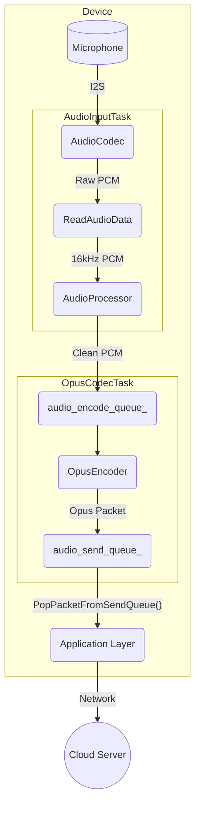
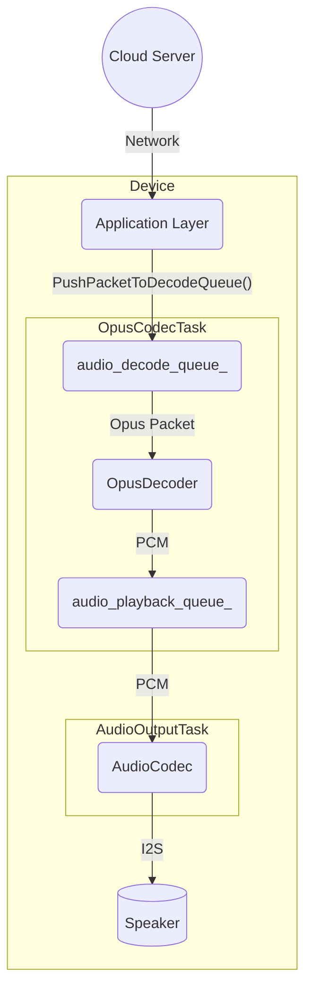

# Kiến trúc Dịch vụ Âm thanh

Dịch vụ âm thanh là thành phần cốt lõi chịu trách nhiệm quản lý tất cả các chức năng liên quan đến âm thanh, bao gồm thu âm từ microphone, xử lý âm thanh, mã hóa/giải mã, và phát lại âm thanh qua loa. Nó được thiết kế theo mô hình module và hiệu quả, chạy các hoạt động chính trong các task FreeRTOS dành riêng để đảm bảo hiệu suất thời gian thực.

## Các Thành phần Chính

-   **`AudioService`**: Bộ điều phối trung tâm. Nó khởi tạo và quản lý tất cả các thành phần âm thanh khác, task và hàng đợi dữ liệu.
-   **`AudioCodec`**: Lớp trừu tượng phần cứng (HAL) cho chip codec âm thanh vật lý. Nó xử lý giao tiếp I2S thô cho đầu vào và đầu ra âm thanh.
-   **`AudioProcessor`**: Thực hiện xử lý âm thanh thời gian thực trên dòng đầu vào từ microphone. Điều này thường bao gồm Hủy Echo Âm thanh (AEC), ức chế nhiễu, và Phát hiện Hoạt động Giọng nói (VAD). `AfeAudioProcessor` là triển khai mặc định, sử dụng Audio Front-End của ESP-ADF.
-   **`WakeWord`**: Phát hiện từ khóa (ví dụ: "Xin chào, Xiao Zhi", "Hi, ESP") từ dòng âm thanh. Nó chạy độc lập với bộ xử lý âm thanh chính cho đến khi phát hiện từ đánh thức.
-   **`OpusEncoderWrapper` / `OpusDecoderWrapper`**: Quản lý việc mã hóa âm thanh PCM sang định dạng Opus và giải mã gói Opus trở lại PCM. Opus được sử dụng nhờ tỷ lệ nén cao và độ trễ thấp, lý tưởng cho streaming giọng nói.
-   **`OpusResampler`**: Công cụ tiện ích để chuyển đổi dòng âm thanh giữa các tỷ lệ lấy mẫu khác nhau (ví dụ: lấy mẫu lại từ tỷ lệ lấy mẫu gốc của codec sang 16kHz cần thiết cho xử lý).

## Mô hình Luồng (Threading)

Dịch vụ hoạt động trên ba task chính để xử lý các giai đoạn khác nhau của pipeline âm thanh đồng thời:

1.  **`AudioInputTask`**: Chỉ chịu trách nhiệm đọc dữ liệu PCM thô từ `AudioCodec`. Sau đó, nó cung cấp dữ liệu này cho engine `WakeWord` hoặc `AudioProcessor` dựa trên trạng thái hiện tại.
2.  **`AudioOutputTask`**: Chịu trách nhiệm phát âm thanh. Nó lấy dữ liệu PCM đã giải mã từ `audio_playback_queue_` và gửi đến `AudioCodec` để phát trên loa.
3.  **`OpusCodecTask`**: Task worker xử lý cả mã hóa và giải mã. Nó lấy âm thanh thô từ `audio_encode_queue_`, mã hóa thành gói Opus, và đặt chúng vào `audio_send_queue_`. Đồng thời, nó lấy gói Opus từ `audio_decode_queue_`, giải mã chúng thành PCM, và đặt kết quả vào `audio_playback_queue_`.

## Luồng Dữ liệu

Có hai luồng dữ liệu chính: đầu vào âm thanh (uplink) và đầu ra âm thanh (downlink).

### 1. Luồng Đầu vào Âm thanh (Uplink)

Luồng này thu âm thanh từ microphone, xử lý nó, mã hóa, và chuẩn bị gửi đến máy chủ.

-   `AudioInputTask` liên tục đọc dữ liệu PCM thô từ `AudioCodec`.
-   Dữ liệu này được cung cấp vào `AudioProcessor` để làm sạch (AEC, VAD).
-   Dữ liệu PCM đã xử lý được đẩy vào `audio_encode_queue_`.
-   `OpusCodecTask` lấy dữ liệu PCM, mã hóa thành định dạng Opus, và đẩy gói kết quả vào `audio_send_queue_`.
-   Ứng dụng sau đó có thể lấy các gói Opus này và gửi chúng qua mạng.

### 2. Luồng Đầu ra Âm thanh (Downlink)

Luồng này nhận dữ liệu âm thanh đã mã hóa, giải mã nó, và phát trên loa.

-   Ứng dụng nhận gói Opus từ mạng và đẩy chúng vào `audio_decode_queue_`.
-   `OpusCodecTask` lấy các gói này, giải mã chúng trở lại dữ liệu PCM, và đẩy dữ liệu vào `audio_playback_queue_`.
-   `AudioOutputTask` lấy dữ liệu PCM từ hàng đợi và gửi đến `AudioCodec` để phát lại.

## Quản lý Năng lượng

Để tiết kiệm năng lượng, các kênh đầu vào (ADC) và đầu ra (DAC) của codec âm thanh được tự động tắt sau một khoảng thời gian không hoạt động (`AUDIO_POWER_TIMEOUT_MS`). Một timer (`audio_power_timer_`) định kỳ kiểm tra hoạt động và quản lý trạng thái năng lượng. Các kênh được tự động bật lại khi cần thu hoặc phát âm thanh mới.